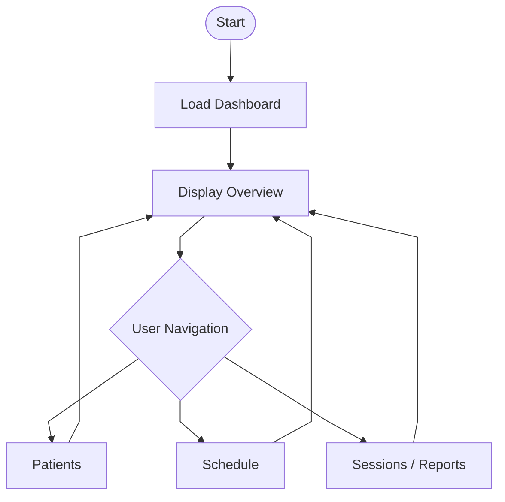

# 🧠 MindTrack — Psychology Dashboard (MVP)

A web-based dashboard designed to help psychologists manage their workflow in a simple and structured way.

This project represents the **first MVP version**, focused on building a clean and scalable interface using only **HTML and CSS**, with a strong emphasis on layout structure, visual hierarchy and product thinking.

---

## 🌐 Live Preview

> [MindTrack Website](https://aresmatheus97-gif.github.io/MindTrack/)

---

## 📌 Project Overview

MindTrack was created based on a simple observation:

> Many psychologists manage their workflow using scattered tools (spreadsheets, notes, messaging apps).

This project aims to centralize that experience into a **single, clean dashboard interface**, improving clarity and organization.

---

## 🧠 Planning & Development Logic

Before writing code, the project was structured with:

* Definition of core user (psychologists)
* Identification of real workflow problems
* Breakdown into modules (patients, schedule, sessions)
* Creation of flowcharts to define system behavior
* Separation of concerns:

  * Structure (HTML)
  * Styling (CSS)
  * Logic (future JavaScript)

The goal was to simulate a **real product development mindset**, not just build a visual interface.

---

## ⚙️ MVP Scope (v0.1.1)

This version focuses on the **foundation of the interface**.

### Included:

* Sidebar navigation (structured modules)
* Dashboard overview
* Quick action buttons
* Statistics cards
* Recent sessions table
* Static calendar component
* Daily sessions preview
* Professional layout and spacing system
* Patients page implemented

### Not included (yet):

* JavaScript logic
* Data persistence
* Authentication system

---

## 🧱 Interface Structure

The dashboard is divided into:

* **Sidebar:** navigation and user context
* **Topbar:** contextual greeting and date
* **Main Content:**

  * Quick actions
  * Overview metrics
  * Recent activity
  * Calendar + sessions

All elements were designed to be **modular and reusable**.

---

## 🎨 Design Decisions

The interface was built considering:

* Calm and neutral color palette (clinical environment)
* Clear typography hierarchy (Lora + Inter)
* Minimalist layout to reduce cognitive load
* Consistent spacing and component patterns

The goal is to create a **professional and non-overwhelming experience**, aligned with the psychology field.

---

## 🤖 AI-Assisted Development

Part of the structure and styling was developed with support from **Claude AI**, using a controlled approach:

* Use of `rules.md` to constrain outputs
* Use of `claude.md` to define and guide the entire project structure
* Iterative refinement of layout and components
* Manual validation and understanding before applying changes

> Important: The overall structure was defined through `claude.md`, and no generation was imagined by the AI without prior structural direction. Only code that I understand is kept in the project.

---

## 🔄 Methodology

The project follows a structured approach:

1. Problem understanding
2. Interface planning
3. Flow definition
4. Static implementation (HTML + CSS)
5. Future logic integration

### 🧭 Application Flow (MVP)



---

## 🗺️ Roadmap

### v0.2.0

* Introduce JavaScript
* Dynamic data rendering
* Navigation behavior

### v0.3.0

* LocalStorage integration
* CRUD operations (patients, sessions)
* Better User Experience

### v0.4.0

* Authentication system
* Data validation

### Future

* Local storage
* Advanced analytics

---

## 📁 Project Structure

```
/project-root
│
├── index.html
├── /assets
│   └── /css
│       └── estilo.css
```

---

## 🚀 Continuous Improvement

This project will be continuously updated as I progress in my studies.

New features, refactoring and improvements will be added incrementally, following a structured learning approach.

---

## 🧑‍💻 Author

Developed as part of my journey into web development, focusing on building real-world projects with practical value.

---
